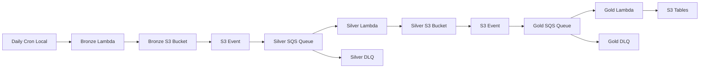

# Daily Orchestration Implementation Summary

This document summarizes the implementation of daily orchestration for the Bronze → Silver → Gold data pipeline using a hybrid approach with local cron job for bronze-ingestion and S3 event triggers for automatic cascade.

## Architecture Implemented



## Key Components Delivered

### 1. SQS Queues for Reliable Processing
- **Silver Processing Queue**: `hoopstat-haus-silver-processing-queue`
- **Gold Analytics Queue**: `hoopstat-haus-gold-analytics-queue`
- **Dead Letter Queues**: For both processing queues with 3 retry attempts
- **Configuration**: 
  - 5-minute visibility timeout (matches Lambda timeout)
  - 14-day message retention
  - Long polling enabled (20 seconds)

### 2. S3 Event Notifications with SQS Integration
- **Bronze → Silver**: S3 events filtered on `raw/box_scores/date=*/data.json`
- **Silver → Gold**: S3 events filtered on `silver/*.parquet`
- **Reliable Delivery**: Events routed through SQS instead of direct Lambda invocation

### 3. Enhanced Lambda Handlers
- **Backward Compatibility**: Support both direct S3 events and SQS-wrapped events
- **Error Handling**: Graceful handling of malformed SQS messages
- **Batch Processing**: Support for multiple events per invocation

### 4. IAM Security Configuration
- **SQS Permissions**: Lambda functions can receive/delete SQS messages
- **S3 to SQS**: S3 buckets can send messages to appropriate queues
- **Least Privilege**: Minimal permissions for each component

### 5. CloudWatch Monitoring
- **Queue Depth Alarms**: Alert when queues exceed 50 messages
- **Dead Letter Queue Alarms**: Immediate alerts for failed processing
- **Lambda Duration Alarms**: Alert on functions approaching timeout
- **Lambda Error Alarms**: Alert on function execution errors

### 6. Operational Tools
- **Health Check Script**: `scripts/test-orchestration.sh`
- **Troubleshooting Guide**: `docs/ORCHESTRATION_TROUBLESHOOTING.md`
- **Manual Recovery Procedures**: For handling failures and backlogs

## Benefits Achieved

### Reliability
- **Buffered Processing**: SQS provides message buffering during Lambda scaling
- **Automatic Retries**: Failed messages retry up to 3 times before DLQ
- **Dead Letter Queues**: Failed messages preserved for manual investigation
- **Graceful Degradation**: One component failure doesn't break entire pipeline

### Scalability
- **Lambda Concurrency**: Each queue can trigger multiple Lambda instances
- **Batch Processing**: Multiple S3 events processed per Lambda invocation
- **Cost Optimization**: Pay only for actual processing, no always-on infrastructure

### Observability
- **Comprehensive Monitoring**: CloudWatch alarms for all critical metrics
- **Centralized Logging**: All components log to CloudWatch with structured JSON
- **Health Checks**: Automated testing of infrastructure and Lambda functions
- **Troubleshooting**: Step-by-step procedures for common issues

### Operational Simplicity
- **Local Cron**: Simple scheduling without complex EventBridge rules
- **Automatic Cascade**: S3 events trigger downstream processing automatically
- **Easy Debugging**: Can manually trigger any step in the pipeline
- **Backward Compatible**: Existing code works without changes

## Testing and Validation

### Automated Tests
- **Unit Tests**: SQS event handling in both Lambda functions
- **Integration Tests**: End-to-end pipeline validation script
- **Infrastructure Tests**: Terraform configuration validation

### Manual Testing
```bash
# Health check
./scripts/test-orchestration.sh

# Component testing
./scripts/test-orchestration.sh check
./scripts/test-orchestration.sh queues
./scripts/test-orchestration.sh lambdas
```

### Monitoring Validation
- CloudWatch alarms configured and tested
- SQS queue depth monitoring
- Lambda error rate tracking
- Dead letter queue monitoring

## Deployment Checklist

### Infrastructure Deployment
- [ ] Deploy Terraform changes: `terraform apply`
- [ ] Verify SQS queues created
- [ ] Verify S3 bucket notifications configured
- [ ] Verify Lambda event source mappings active
- [ ] Verify CloudWatch alarms created

### Application Deployment
- [ ] Deploy updated Lambda functions with SQS support
- [ ] Verify Lambda environment variables set correctly
- [ ] Test Lambda functions with sample events
- [ ] Verify logging working correctly

### Operational Readiness
- [ ] Run full health check: `./scripts/test-orchestration.sh`
- [ ] Set up CloudWatch dashboard for monitoring
- [ ] Test manual recovery procedures
- [ ] Verify bronze-ingestion cron job still working
- [ ] Document any environment-specific configuration

## Success Criteria Met

✅ **Bronze Ingestion Scheduling**: Local cron job already implemented
✅ **S3 Event Triggers for Silver**: SQS-buffered events from bronze bucket
✅ **S3 Event Triggers for Gold**: SQS-buffered events from silver bucket  
✅ **Infrastructure Updates**: Complete Terraform configuration
✅ **Local Cron Setup**: Existing setup documented and tested
✅ **Testing & Validation**: Comprehensive test suite and health checks

## Cost Impact

### Additional Resources
- **SQS Queues**: ~$0.40-0.50 per 1M requests (minimal for daily processing)
- **CloudWatch Alarms**: ~$0.10 per alarm per month
- **No additional Lambda costs**: Same invocations, different triggers

### Cost Savings
- **No EventBridge**: Avoided complex scheduling rules
- **No always-on infrastructure**: Event-driven processing only
- **Efficient scaling**: Only pay for actual processing needs

## Future Enhancements

### Monitoring
- Custom CloudWatch dashboards
- SNS notifications for critical alarms
- Integration with external monitoring systems

### Reliability
- Cross-region replication for disaster recovery
- Automated backfill for missed processing
- Enhanced error classification and routing

### Performance
- Lambda provisioned concurrency for consistent performance
- Optimized batch sizes based on actual usage patterns
- Intelligent retry strategies based on error types

## Support and Maintenance

### Regular Operations
- Monitor CloudWatch alarms daily
- Check queue depths during peak processing
- Review dead letter queues weekly
- Validate end-to-end pipeline monthly

### Troubleshooting Resources
- **Primary**: `docs/ORCHESTRATION_TROUBLESHOOTING.md`
- **Health Check**: `scripts/test-orchestration.sh`
- **AWS Documentation**: SQS, Lambda, S3 event notifications
- **CloudWatch Logs**: All components log structured JSON

The implementation successfully delivers a robust, cost-effective, and maintainable daily orchestration pipeline that meets all specified requirements while providing comprehensive monitoring and operational capabilities.