# Hoopstat Haus v1 Architecture Diagram

This diagram represents the complete end-to-end architecture of the Hoopstat Haus AI-Native Basketball Analytics Platform, showing the data flow from NBA API ingestion through the Medallion Architecture to natural language search capabilities.

```mermaid
graph TB
    %% External Data Sources
    subgraph "External Data Sources"
        NBA_API["NBA API
        nba-api Python Library
        • Game Statistics
        • Player Data
        • Team Information
        • Historical Records"]
        
        SCHEDULE["NBA Schedule API
        • Game Schedules
        • Season Calendar
        • Playoff Structure"]
    end

    %% Data Ingestion Layer
    subgraph "Data Ingestion Layer"
        BRONZE_APP["Bronze Ingestion App
        Python + Docker
        • Daily ETL Pipeline
        • Error Handling
        • Rate Limiting
        • Data Validation"]
        
        SCHEDULER["GitHub Actions
        Scheduled Workflows
        • 4:30 AM ET Daily
        • Backup at 5:30 AM
        • Weekend/Holiday Logic"]
    end

    %% AWS Cloud Infrastructure
    subgraph "AWS Cloud Infrastructure"
        %% Storage Layer - Medallion Architecture
        subgraph "S3 Data Lake - Medallion Architecture"
            subgraph "Bronze Layer"
                S3_BRONZE["S3 Bronze Bucket
                hoopstat-haus-bronze
                • Raw JSON → Parquet
                • Partitioned by Date
                • 2 Year Retention
                • Immutable Storage"]
            end
            
            subgraph "Silver Layer"
                S3_SILVER["S3 Silver Bucket
                hoopstat-haus-silver
                • Cleaned & Validated
                • Schema Enforced
                • Deduplicated
                • 3 Year Retention"]
            end
            
            subgraph "Gold Layer"
                S3_GOLD["S3 Gold Bucket
                hoopstat-haus-gold
                • Business-Ready
                • Pre-Aggregated
                • MCP-Optimized
                • Indefinite Retention"]
            end
        end

        %% Processing Pipeline
        subgraph "Data Processing Pipeline"
            SILVER_ETL["Silver ETL Jobs
            Python + Lambda
            • Data Cleaning
            • Quality Validation
            • Schema Standardization
            • SCD Type 2"]
            
            GOLD_ETL["Gold ETL Jobs
            Python + Lambda
            • Business Aggregations
            • Performance Metrics
            • Lookup Tables
            • API-Ready Datasets"]
        end

        %% AI-Native Access Layer
        subgraph "AI-Native Access Layer"
            API_GW["API Gateway
            • Authentication
            • Rate Limiting
            • CORS Policy
            • Request Validation"]
            
            MCP_SERVER["MCP Server
            Lambda Function
            • Model Context Protocol
            • Basketball Data APIs
            • Query Optimization
            • Response Caching"]
            
            BEDROCK["Amazon Bedrock
            • LLM Processing
            • Natural Language
            • Context Management
            • AI Orchestration"]
        end

        %% Infrastructure Services
        subgraph "AWS Infrastructure Services"
            IAM["IAM Roles & Policies
            • Least Privilege
            • OIDC Integration
            • Cross-Service Access"]
            
            SECRETS["AWS Secrets Manager
            • API Keys
            • Configuration
            • Rotation Support"]
            
            CLOUDWATCH["CloudWatch
            • Application Logs
            • Performance Metrics
            • Cost Monitoring
            • Alerting"]
            
            LAMBDA["Lambda Functions
            • Serverless Compute
            • Event-Driven
            • Auto-Scaling"]
        end
    end

    %% User Interface Layer
    subgraph "User Interface Layer"
        FRONTEND["Thin Client Frontend
        Static Web Application
        • React/Vue/Svelte
        • Mobile-First Responsive
        • Anonymous Access
        • Simple Text Interface"]
        
        CDN["CloudFront CDN
        • Global Distribution
        • Static Asset Caching
        • SSL/TLS Termination
        • Custom Domain"]
    end

    %% AI Agents and External Consumers
    subgraph "AI Agents & External Consumers"
        AI_AGENTS["AI Agents
        • ChatGPT Plugins
        • Claude Extensions
        • Custom Bots
        • Developer Tools"]
        
        USERS["End Users
        • Basketball Fans
        • Coaches & Analysts
        • Sports Journalists
        • Fantasy Players"]
    end

    %% Development & Deployment
    subgraph "Development & Deployment"
        GITHUB["GitHub Repository
        Monorepo Structure
        • Apps (Python)
        • Libs (Shared)
        • Infrastructure (Terraform)
        • Meta (Documentation)"]
        
        CICD["GitHub Actions CI/CD
        • Automated Testing
        • Docker Builds
        • Terraform Deploy
        • Security Scanning"]
        
        TERRAFORM["Terraform Infrastructure
        • Infrastructure as Code
        • Environment Management
        • State Management
        • Resource Provisioning"]
    end

    %% Data Flow Connections
    NBA_API --> BRONZE_APP
    SCHEDULE --> BRONZE_APP
    SCHEDULER --> BRONZE_APP
    BRONZE_APP --> S3_BRONZE
    
    S3_BRONZE --> SILVER_ETL
    SILVER_ETL --> S3_SILVER
    
    S3_SILVER --> GOLD_ETL
    GOLD_ETL --> S3_GOLD
    
    S3_GOLD --> MCP_SERVER
    
    %% AI and API Flow
    API_GW --> MCP_SERVER
    API_GW --> BEDROCK
    MCP_SERVER <--> BEDROCK
    
    %% User Interaction Flow
    USERS --> FRONTEND
    FRONTEND --> CDN
    CDN --> API_GW
    
    AI_AGENTS --> API_GW
    
    %% Infrastructure Dependencies
    BRONZE_APP --> IAM
    SILVER_ETL --> IAM
    GOLD_ETL --> IAM
    MCP_SERVER --> IAM
    
    BRONZE_APP --> SECRETS
    MCP_SERVER --> SECRETS
    
    BRONZE_APP --> CLOUDWATCH
    SILVER_ETL --> CLOUDWATCH
    GOLD_ETL --> CLOUDWATCH
    MCP_SERVER --> CLOUDWATCH
    API_GW --> CLOUDWATCH
    
    SILVER_ETL --> LAMBDA
    GOLD_ETL --> LAMBDA
    MCP_SERVER --> LAMBDA
    
    %% Deployment Flow
    GITHUB --> CICD
    CICD --> TERRAFORM
    TERRAFORM --> AWS_INFRA[AWS Infrastructure]
    CICD --> FRONTEND

    %% Styling
    classDef dataSource fill:#e1f5fe,stroke:#0277bd,stroke-width:2px
    classDef storage fill:#f3e5f5,stroke:#7b1fa2,stroke-width:2px
    classDef processing fill:#e8f5e8,stroke:#2e7d32,stroke-width:2px
    classDef ai fill:#fff3e0,stroke:#ef6c00,stroke-width:2px
    classDef frontend fill:#fce4ec,stroke:#c2185b,stroke-width:2px
    classDef infrastructure fill:#f1f8e9,stroke:#558b2f,stroke-width:2px
    classDef deployment fill:#e0f2f1,stroke:#00695c,stroke-width:2px

    class NBA_API,SCHEDULE dataSource
    class S3_BRONZE,S3_SILVER,S3_GOLD storage
    class BRONZE_APP,SILVER_ETL,GOLD_ETL processing
    class MCP_SERVER,BEDROCK,API_GW ai
    class FRONTEND,CDN,USERS,AI_AGENTS frontend
    class IAM,SECRETS,CLOUDWATCH,LAMBDA infrastructure
    class GITHUB,CICD,TERRAFORM deployment
```

## Architecture Overview

This diagram illustrates the complete Hoopstat Haus system architecture, designed to transform raw NBA data into an AI-accessible format that enables natural language basketball analytics.

### Key Architecture Principles

1. **Medallion Data Architecture**: Progressive data refinement through Bronze (raw) → Silver (cleaned) → Gold (business-ready) layers
2. **AI-Native Design**: Purpose-built for AI agent consumption through Model Context Protocol (MCP)
3. **Serverless-First**: Leveraging AWS Lambda and managed services for cost efficiency and scalability
4. **Static Frontend**: Simple, performant user interface with anonymous access
5. **Infrastructure as Code**: Complete automation through Terraform and GitHub Actions

### Data Flow Journey

1. **Ingestion**: Daily automated ingestion from NBA API into Bronze layer Parquet files
2. **Processing**: ETL pipelines transform Bronze → Silver → Gold with data quality validation
3. **AI Access**: MCP Server provides structured access to Gold layer data for AI processing
4. **Natural Language**: Amazon Bedrock processes user queries and orchestrates data retrieval
5. **User Interface**: Thin client frontend enables simple "ask question, get answer" interactions

### Security & Operations

- **Authentication**: API key-based access with rate limiting and abuse prevention
- **Monitoring**: Comprehensive CloudWatch integration for performance and cost tracking
- **Secrets Management**: AWS Secrets Manager for secure configuration and API key storage
- **CI/CD**: Automated testing, building, and deployment through GitHub Actions
- **Infrastructure**: Terraform-managed AWS resources with least-privilege IAM policies

### Scalability & Performance

- **Serverless Compute**: Auto-scaling Lambda functions for variable workloads
- **Intelligent Caching**: Multi-layer caching strategy for cost optimization
- **Global Distribution**: CloudFront CDN for frontend asset delivery
- **Data Partitioning**: Optimized S3 partitioning for efficient query performance

This architecture enables the core value proposition: transforming complex basketball data into accessible insights through natural language interactions, powered by AI and backed by a robust, scalable data platform.

## Component Specifications

### Data Sources
- **NBA API**: Primary source for basketball statistics, games, players, and teams
- **Schedule API**: Game scheduling information for intelligent pipeline execution

### Storage (S3 Medallion Architecture)
- **Bronze Layer**: Raw JSON data converted to Parquet, partitioned by ingestion date
- **Silver Layer**: Cleaned, validated data with schema enforcement and deduplication
- **Gold Layer**: Business-ready aggregations optimized for MCP server consumption

### Processing Pipeline
- **Bronze Ingestion**: Daily Python application with error handling and rate limiting
- **Silver ETL**: Data cleaning, validation, and standardization jobs
- **Gold ETL**: Business aggregation and performance metric calculations

### AI-Native Access
- **MCP Server**: Lambda-based Model Context Protocol server for structured data access
- **Amazon Bedrock**: LLM processing for natural language query interpretation
- **API Gateway**: Authentication, rate limiting, and request routing

### User Interface
- **Thin Client Frontend**: Static web application with mobile-first responsive design
- **CDN**: Global content delivery for optimal performance

### Infrastructure
- **AWS Services**: Serverless-first approach with Lambda, S3, and managed services
- **Terraform**: Infrastructure as Code for repeatable, version-controlled deployments
- **GitHub Actions**: Automated CI/CD for testing, building, and deployment

This architecture represents a modern, AI-native approach to sports analytics, designed for scalability, maintainability, and cost-effectiveness while providing powerful natural language access to basketball data.