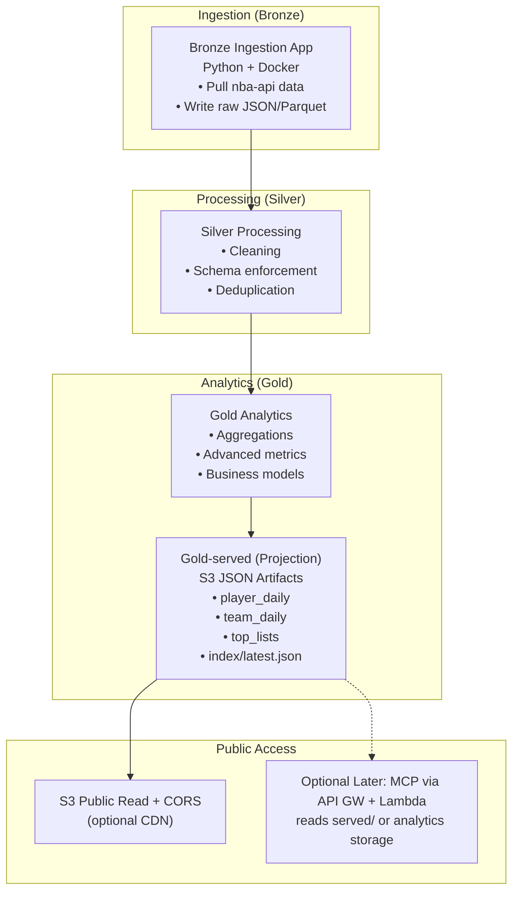

# Hoopstat Haus v2 Architecture Diagram (Stateless JSON-First)

This diagram reflects ADR-027: initial public access via small, precomputed JSON artifacts served directly from S3. MCP is optional later.

