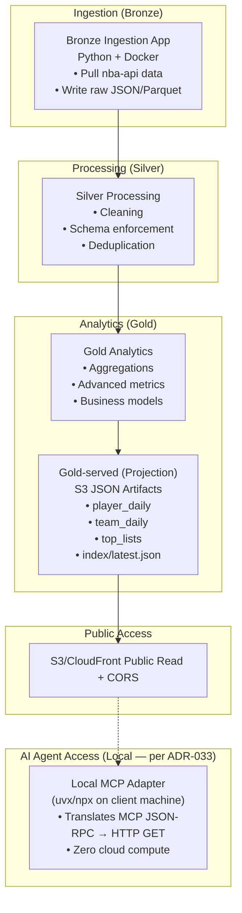

# Hoopstat Haus v2 Architecture Diagram (Stateless JSON-First)

This diagram reflects ADR-027 (stateless JSON artifacts from S3) and ADR-033 (local proxy MCP architecture — no cloud compute for MCP).

```mermaid
graph TB
    subgraph "Ingestion (Bronze)"
        BRONZE_APP["Bronze Ingestion App\nPython + Docker\n• Pull nba-api data\n• Write raw JSON/Parquet"]
    end

    subgraph "Processing (Silver)"
        SILVER_JOBS["Silver Processing\n• Cleaning\n• Schema enforcement\n• Deduplication"]
    end

    subgraph "Analytics (Gold)"
        GOLD_JOBS["Gold Analytics\n• Aggregations\n• Advanced metrics\n• Business models"]
        SERVED["Gold-served (Projection)\nS3 JSON Artifacts\n• player_daily\n• team_daily\n• top_lists\n• index/latest.json"]
    end

    subgraph "Public Access"
        S3_PUBLIC["S3/CloudFront Public Read + CORS"]
    end

    subgraph "AI Agent Access (Local — per ADR-033)"
        LOCAL_MCP["Local MCP Adapter\n(uvx/npx on client machine)\n• Translates MCP JSON-RPC → HTTP GET\n• Zero cloud compute"]
    end

    BRONZE_APP --> SILVER_JOBS --> GOLD_JOBS --> SERVED --> S3_PUBLIC
    S3_PUBLIC -.-> LOCAL_MCP
```
